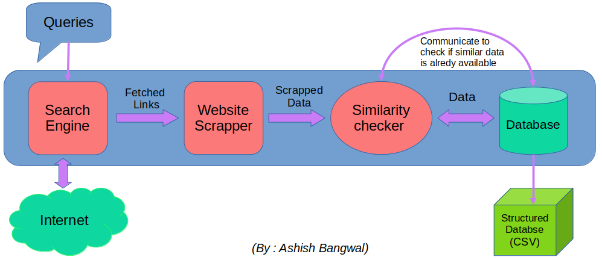

# Lizmotors Coding Assignment for AI/ML Internship 2024

## Retrieval System with Python

Retrieval is the first step of the modern generation models called RAG which stands for retrieval augmented generation, these are a combination of a retrieval system and generation model such as Seq2Seq, LLM, etc. The retrieval part of the model aids and provides information that the generation model might not know, which leads to more accurate and updated responses along with fewer hallucinations and misinformation.
\
In the following, I built a system that can retrieve information from the internet, that can further be stored in a vector database ultimately helping RAG models.

### Pipeline Implemented

### Example Data generated

